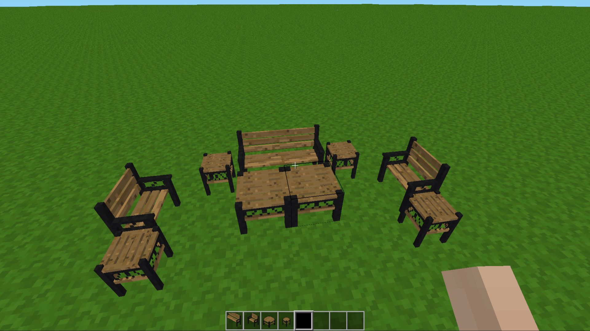
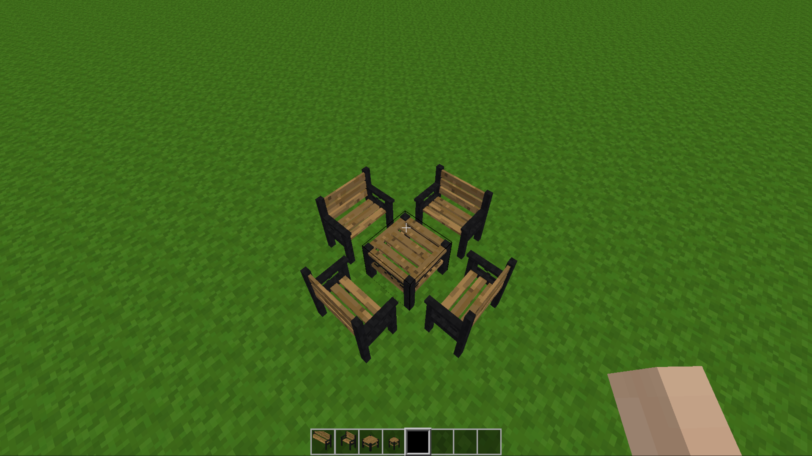
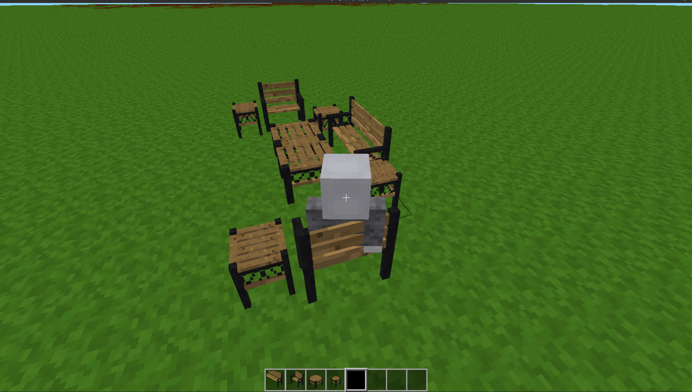
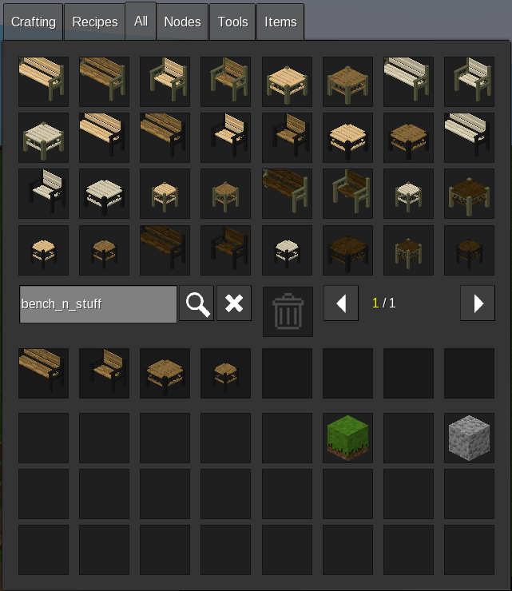

# [Mod] Bench N Stuff [bench_n_stuff] [Ver. 0.1]
Copyright (c) 2015-2016 TumeniNodes

This mod adds customizable benches, chairs, tables, and side tables to Luanti/Minetest.
It works with a few different wood types from the base game and supports both steel and copper patina frames.

## Features

- **Benches and Chairs:** You can right-click them to sit down. Right-click again to stand up.
- **Screwdriver Support:** You can use a screwdriver to rotate the furniture after placing it.
- **Wood Combinations:** Benches, chairs, and tables automatically support Apple wood, Jungle wood, Pine, and Aspen slats.

## Crafting Recipes

All recipes use your choice of standard wood planks for the top, along with either steel ingots (for standard frames) or copper ingots (for patina frames).

### Bench
- Top row: 3 Wood Planks
- Middle row: Steel/Copper Ingot, Empty, Steel/Copper Ingot
- Bottom row: Steel/Copper Ingot, Empty, Steel/Copper Ingot

### Chair
- Top row: 1 Wood Plank, Empty, Empty
- Middle row: Steel/Copper Ingot, Steel/Copper Ingot, Empty

### Table
- Top row: 3 Wood Planks
- Middle row: Steel/Copper Ingot, Steel/Copper Ingot, Steel/Copper Ingot
- Bottom row: Steel/Copper Ingot, Empty, Steel/Copper Ingot

### Side Table
- Top row: 2 Wood Planks, Empty
- Middle row: Steel/Copper Ingot, Steel/Copper Ingot, Empty

## Adding More Woods

If you use other mods that add custom trees, you can open `init.lua` and add their texture and item names to the `wood_types` list at the very top.
The mod will automatically create the new variants and crafting recipes for them.

## Installation

1. Download the mod files.
2. Make sure the main folder is named exactly `bench_n_stuff`.
3. Move the folder into your game's `mods/` directory.
4. Open Luanti/Minetest, go to your world settings, click **Configure Mods**, find `bench_n_stuff`, check the box to enable it, and save.

## Screenshots

